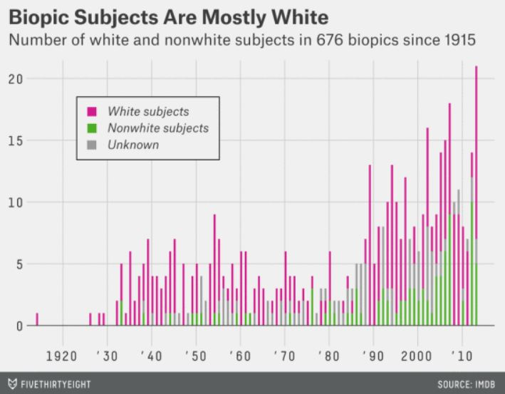

# Setting up our project

I'm a huge fan of nonfiction books and documentaries. I've never loved a lot of the big Hollywood movies, but I do enjoy biopics. I find that they give me a good amount of the nonfiction that I enjoy and the drama that makes a blockbuster hit. But, I often find myself a little disappointed in the breadth of biopics available. Most feature a pretty narrow demographic group: straight, white men. Fivethirtyeight did a nice story on this pattern and published the data they used. So, we are going to use that data to write our own story with ggplot! We will start by recreating the graphics from the article ['Straight Outta Compton' is the rare biopic not about white dudes](https://fivethirtyeight.com/features/straight-outta-compton-is-the-rare-biopic-not-about-white-dudes/) and then make some of our own!

### Packages needed

First, we'll need to install a few packages. The`tidyverse` package includes both `readr` and `ggplot2`, two of the packages we will be using. 

```{r message=FALSE, warning=FALSE}
library(tidyverse)
library(ggthemes)
library(Hmisc)
```


### Data from the web

Fivethirtyeight publishes a lot of the data they use on [github]("https://github.com/fivethirtyeight/data")! We're going to use their `biopics` data. Fivethirtyeight data is also available in an R package call `fivethirtyeight` but I learned by using their github repo, so that's the method I prefer. Either way will get you the same data! 

```{r message = FALSE eval = FALSE}
# read in the data from github

biopics <- read_csv("https://raw.githubusercontent.com/fivethirtyeight/data/master/biopics/biopics.csv")
```

### Structure of the data
The describe provides the quickest means of data exploration

```{r}
describe(biopics)
```

Looking at the data I find these interesting:
1) Only 668 distinct titles out of 761, so in cases where there are multiple subjects in the same movie, there seems to be multiple rows of data for each subject 
2) I guessed even the distinct sites would be 668 but its 672, not important, move on
3) The country of the movie is US UK and Canada
4) Analysis ranges from 1915 - 2014
5) Cant make out clearly but are there some blanks in box office?
6) Race and gender among knowms is roughly in 75-25 proportion
# Visualizations

## Notes about `ggplot`

ggplot adheres to the "grammar of graphics" (hence the gg!), 
or the idea that graphics should have a standard structure the same way that language does. The idea is to allow
people to use the standard structure of plots to move beyond standard graphics. It was largely popularized by Hadley
Wickham after being introduced by Leland Wilkinson in 1999. In 2016, `ggplot2` was the fifth
most downloaded package for `R`.

Essentially the grammar of graphics uses layering to create plots. You first start with your mapping of which 
variables map to which `aesthetics` on your plot. Then you specify the `geom` or method of displaying the data, such
as a point or bar. After that you get into the design elements. That's of course a very brief overview, but you'll
see how we can use that structure in this tutorial! 

A great resource for `ggplot` is this [Cheat Sheet](https://www.rstudio.com/wp-content/uploads/2015/03/ggplot2-cheatsheet.pdf)
and as with everything else in R, a little googling will get you a long way. 

## Looking at race

We will evetually create this graph!




First, we need to decide what variable maps to each aesthetic. In `ggplot`, aesthetics are essentially how variables are mapped to something visual, such as an axis or the color.

#### Setting up the axes

To start we need to calculate totals for each racial group in each year. But right now, our `subject_race` variable doesn't quite tell us the information we want. We can combine the information from `race_known` and `subject_race` to get a variable with three levels: `Unknown`, `White subjects`, and `Nonwhite subjects`. 


```{r}
biopics <- biopics %>% # start with our original data
  mutate(race_plotting = ifelse(race_known == "Unknown", "Unknown", ifelse(subject_race == "White", "White subjects", "Nonwhite subjects"))) # this says, if race_known is unknown, stop there and just mark unknown. But if we know the race, check to see if the race is coded as white. If it is, mark white and stop there. If not, mark nonwhite. 

race_plot <- biopics %>% 
  group_by(year_release, race_plotting) %>% # we want our calculation of the total to be per racial group, per year
  summarise(total = n()) # count up the observations in each group!

race_plot$race_plotting <- factor(race_plot$race_plotting, levels = c("White subjects", "Nonwhite subjects", "Unknown")) # change around the order of our factor levels for plotting purposes
```

In this graph, it loots like a `count` of total movies is the `y axis` and `year_release` is mapped to the `x axis`. 

```{r}
# first we need to create a variable for that!

ggplot(data = race_plot, aes(x= year_release)) # setting our x axis to year_release from the biopics table

```

Nice! Now we have the beginnings of a plot. 

#### Adding a geom layer

Next, we need to add our `geom` layer. This is what the shapes on your plot are (line, point, bar, .....). We are using `geom_bar`! 

```{r}
ggplot(data = race_plot, aes(x = year_release, y = total)) +
  geom_bar(stat = "identity") # stat="identity" argument allows us to map to a y aesthetic with geom_bar! 
```


#### Adding colors!

In the fivethirtyeight plot, colors correspond to whether or not the subject was white. We will modify our plot to show that as well (and try to pick the same colors in the process)!


```{r}
ggplot(data = race_plot, aes(x= year_release, y = total)) +
  geom_bar(aes(fill = race_plotting), stat = "identity") 
```

Closer! Now let's add a title, subtitle, and axis labels! One quick note about the subtitle: `fivethirtyeight` filtered out some of their data. We have 761 biopics in this data so that's the value we will use instead of 676. 

#### Adding labels

```{r}
ggplot(data = race_plot, aes(x= year_release, y = total)) +
  geom_bar(aes(fill = race_plotting), stat = "identity") + 
  labs(title = "Biopic Subjects Are Mostly White", 
       subtitle = "Number of white and nonwhite subjects in 761 biopics since 1915", 
       x = NULL, 
       y = NULL)
```

#### Changing colors

Next, we will add a manual scale to change the colors! I searched around using the google color picker to find the closest matches. 

```{r}
ggplot(data = race_plot, aes(x= year_release, y = total)) +
  geom_bar(aes(fill = race_plotting), stat = "identity") + 
  labs(title = "Biopic Subjects Are Mostly White", 
       subtitle = "Number of white and nonwhite subjects in 761 biopics since 1915", 
       x = NULL, 
       y = NULL) +
  scale_fill_manual(values = c("#d847be", "#36bc6c", "#909392")) # I changed the color scale as well as the width of the bars so we can see the colors more easily
```

#### Changing the final look of the plot

Now we have pretty much all of the elements in place! The last things we will do will focus on the look of the plot. 

First, we want to move the legend to the upper lefthand corner of the plot. 

```{r}
ggplot(data = race_plot, aes(x= year_release, y = total)) +
  geom_bar(aes(fill = race_plotting), stat = "identity", width = 0.6) + 
  labs(title = "Biopic Subjects Are Mostly White", 
       subtitle = "Number of white and nonwhite subjects in 761 biopics since 1915", 
       x = NULL, 
       y = NULL) +
  scale_fill_manual(values = c("#d847be", "#36bc6c", "#909392")) +
  theme(legend.position = c(.2,.7), 
        legend.background = element_rect(fill="lightgray",
                                         size=0.5, 
                                         linetype="solid", 
                                         colour ="darkgray"),
        legend.title = element_blank())
  
```

One nice trick with ggplot is the package `ggthemes`. It has preloaded templates for different popular press outlets and plotting tools. Lucky for us, there's a `fivethirtyeight` theme. We'll use that to make our lives a little easier, but you could style it the same way with your own `ggplot` code! In this case, though, why reinvent the wheel?

Notice in the code below that `theme_fivethirtyeight` has to come before our `theme` arguments. We want to override a few defaults from `ggtheme` and `R` executes code sequentially. If you write them in the other order, you'll be overriding our overrides. 


```{r}
ggplot(data = race_plot, aes(x= year_release, y = total)) +
  geom_bar(aes(fill = race_plotting), stat = "identity", width = 0.6) + 
  labs(title = "Biopic Subjects Are Mostly White", 
       subtitle = "Number of white and nonwhite subjects in 761 biopics since 1915", 
       x = NULL, 
       y = NULL) +
  scale_fill_manual(values = c("#d847be", "#36bc6c", "#909392")) +
  theme_fivethirtyeight() +
  theme(legend.position = c(.2,.7), 
        legend.background = element_rect(fill="#eaedeb",
                                         size=0.5, 
                                         linetype="solid", 
                                         colour ="darkgray"),
        legend.direction = "vertical",
        legend.title = element_blank(),
        legend.text = element_text(face = "italic"))
```

Ta-da! Done! That wasn't so bad, right? On to our next viz! 


## Looking at gender

We will follow pretty similar steps for our next viz, so I'm going to move a little more quickly through the steps. Refer back to the previous explanations if you get stuck, or feel free to shout out questions! 

First, take a look at our goal for this part of the activity!


Take a minute to think about how the variables are being mapped to different aesthetics in this plot. What is the x-axis? Y-axis? Color? 

#### Setting up our data

```{r}
gender_plotting <- biopics %>%
  group_by(subject_sex,year_release) %>%
  summarise(total = n()) # this is going to calculate the number of biopics about men and women separately for each year
```

#### Setting up our axes

```{r}
ggplot(data = gender_plotting, aes(x = year_release, y = total))
```

#### Lets add our `geom`!

```{r}
ggplot(data = gender_plotting, aes(x = year_release, y = total)) +
  geom_bar(stat = "identity") # don't forget stat = "identity"
```

#### Adding colors and a legend

```{r}
# changing the stacking order

gender_plotting$subject_sex <- factor(gender_plotting$subject_sex, levels = c("Male", "Female"))


ggplot(data = gender_plotting, aes(x = year_release, y = total, fill = subject_sex)) +
  geom_bar(stat = "identity") 
```

We can already see a pretty clear pattern in the data and we've done the hard part of plotting! Now let's make it a little prettier. We will use a lot of the same code from our last plot for the design aspects!


#### Design

In this section, I'll introduce saving a plot as a variable so that we don't have to type the same thing over and over. 

```{r}
# I again changed the width of the bars here

g <- ggplot(data = gender_plotting, aes(x = year_release, y = total, fill = subject_sex)) +
  geom_bar(stat = "identity", width = 0.6) +
  labs(title = "Biopic Subjects Are Mostly Male", 
       subtitle = "Number of male and female subjects in 761 biopics since 1915", 
       x = NULL, 
       y = NULL)

g

# add the right colors now!

g <- g +
  scale_fill_manual(values = c("#f9cd52", "#4304a0"))

g

# format the legend in a better way and add the fivethirtyeight theme!
g <- g +
  theme_fivethirtyeight() +
  theme(legend.position = c(.2,.7), 
        legend.background = element_rect(fill="#eaedeb",
                                         size=0.5, 
                                         linetype="solid", 
                                         colour ="black"),
                                          
        legend.direction = "vertical",
        legend.title = element_blank(),
        legend.text = element_text(face = "italic"))
  
g
```

Nice! Now we've finished recreating the two graphics from the article, but there are so many others. We'll walk through creating one more. To combine the previous two graphs (and learn a new feature of ggplot!), we'll make a plot of gender and race in biopics. The article claims that women of color are by far the most underrepresented, so this plot will allow us to see that pattern.

## Race and gender, together

For this plot, we don't have an image of the goal we are working towards. In the end we want to have two side by side plots of race in biopics. To do this we will learn about `facet`, a feature in `ggplot` that allows you to create side by side plots separated by a categorical variable (such as sex). 

But, we have a slight numerical problem. As we saw in the gender plot, men are way more represented. So it will be hard to compare racial patterns between men and women when we are comparing on different scales. Instead we want to use percentages, so we will fix that problem with `dplyr`!

```{r}
race_and_gender <- biopics %>% # start with our original data
  group_by(subject_sex, race_plotting) %>% # group it by race and gender
  summarise(count = n()) %>% # calculate the number in each group
   mutate(prop = count/sum(count)) # calculate relative frequency
  
```

We are going to make a cooler (in my opinion!) version of the bar plot. We'll take advantage of `ggplot` to combine `geom` elements to create something new! We are essentially going to create a lollipop chart.

In this section I'm not going to write the code for the plots as methodically, but I'll be sure to leave plenty of comments!

```{r}
ggplot(race_and_gender) + # we are going to set our aesthetics in the geoms this time!
  geom_linerange(aes(x = race_plotting, ymin = 0, ymax = prop-0.01), size = 1) + # add the lines that lead up to the points
  geom_point(aes(x = race_plotting, y = prop, color = race_plotting), size = 5) + # add a point at the proportion value on the x axis
  geom_text(aes(x = race_plotting, y = prop + 0.07, label = round(prop, 2))) + # write the proportion 0.07 points above the point (so you can see it better! no overlap)
  facet_wrap(~subject_sex) + # separate by gender
  scale_color_manual(values = c("#d847be", "#36bc6c", "#909392")) + # change colors to match the earlier plot
  theme_fivethirtyeight() +
  theme(legend.background = element_rect(fill="#eaedeb",
                                         size=0.5, 
                                         linetype="solid", 
                                         colour ="black"),
                                          
        legend.direction = "vertical",
        legend.title = element_blank(),
        legend.text = element_text(face = "italic")) +
        labs(title = "Racial representation doesn't vary by gender", subtitle = "Based on data from 761 biopics since 1915", y = "Proportion of biopics")
```

To get an idea of magnitude, though, we will also plot the raw values in a similar way! But now we can read those values more critically than we might have before. These two plots together help to tell a very compelling story!


```{r}
# the code for this plot is almost the same as the previous one. the only difference is the y variable! and the labels. 

ggplot(race_and_gender) + # we are going to set our aesthetics in the geoms this time!
  geom_linerange(aes(x = race_plotting, ymin = 0, ymax = count-0.1), size = 1) +
  geom_point(aes(x = race_plotting, y = count, color = race_plotting), size = 5) +
  facet_wrap(~subject_sex) +
  scale_color_manual(values = c("#d847be", "#36bc6c", "#909392")) +
  theme_fivethirtyeight() +
  theme(legend.background = element_rect(fill="#eaedeb",
                                         size=0.5, 
                                         linetype="solid", 
                                         colour ="black"),
                                          
        legend.direction = "vertical",
        legend.title = element_blank(),
        legend.text = element_text(face = "italic")) +
  labs(title = "Biopics heavily favor white, male subjects", subtitle = "Based on data from 761 biopics since 1915", y = "Number of biopics")
```

# Your turn!

Try to create your own data story using the `biopics` data. Some ideas are:

* How does the distribution of box office earnings vary by demographic group?

* How does occupation of subject vary by demographic group?

* Does country of production have an impact on demographics of the subject?

* How about movies with multiple subjects? (some movies are in the table twice for that reason!)

Happy coding!